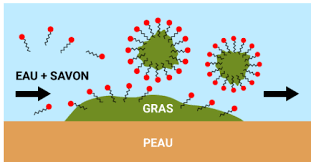

# 06 – Tensioactifs : rôle et usage en cosmétologie 📖 Trace écrite

**Produits lavants – Molécules amphiphiles – Choix des excipients fonctionnels**

---

## 1️⃣ Définition d’un tensioactif

Un **tensioactif** est une substance capable de **modifier les interactions entre deux milieux non miscibles**, en particulier entre l’eau et les corps gras.

En cosmétologie, les tensioactifs sont utilisés principalement pour :

- le **nettoyage**,
- la **solubilisation**,
- l’**émulsification**,
- et la **dispersion** de substances insolubles dans l’eau.

Les tensioactifs sont des **excipients fonctionnels essentiels** dans les produits cosmétiques lavants.

---

## 2️⃣ Structure amphiphile des tensioactifs

Un tensioactif est une **molécule amphiphile**, c’est-à-dire qu’elle possède :

- une **partie hydrophile**, qui présente une affinité pour l’eau,
- une **partie hydrophobe**, qui présente une affinité pour les corps gras.

Cette structure permet au tensioactif de se positionner à l’interface entre l’eau et les salissures grasses, facilitant ainsi leur élimination lors du rinçage.

Les molécules de tensioactif entourent la graisse pour former des agregats appelés **micelles**, avec leur partie hydrophobe tournée vers le gras et leur partie hydrophile vers l’eau. Ainsi, la graisse est décrochée de la peau et entraînée par l’eau lors du rinçage.

---

## 3️⃣ Rôle des tensioactifs dans les produits lavants

Dans un produit lavant, les tensioactifs permettent :

- de **décrocher les salissures** et le sébum de la peau ou des cheveux,
- de **mettre en suspension** ces salissures dans l’eau,
- de permettre leur **élimination lors du rinçage**.

Le rôle principal d’un tensioactif est donc le **nettoyage**, mais il doit être assuré sans altérer excessivement la barrière cutanée.

---

## 4️⃣ Familles de tensioactifs en cosmétologie

On distingue plusieurs **familles de tensioactifs**, classées selon la charge de leur partie hydrophile :

- **Tensioactifs anioniques**  
  Pouvoir lavant élevé, souvent très moussants, mais pouvant être irritants.

- **Tensioactifs cationiques**  
  Peu utilisés pour le lavage, principalement employés comme agents conditionneurs.

- **Tensioactifs amphotères**  
  Pouvoir lavant modéré, bonne tolérance cutanée, souvent associés à d’autres tensioactifs.

- **Tensioactifs non ioniques**  
  Pouvoir lavant doux, très bonne tolérance, peu sensibles à la dureté de l’eau.

---

## 5️⃣ Choix des tensioactifs et tolérance cutanée

Le choix d’un tensioactif dépend :

- de l’**usage du produit** (gel douche, shampooing, savon),
- de la **zone d’application** (corps, visage, cuir chevelu),
- du **type de peau ou de cheveux**,
- de la **fréquence d’utilisation**.

En cosmétologie, plusieurs tensioactifs sont souvent **associés** afin de :

- maintenir une **efficacité lavante suffisante**,
- **limiter l’irritation**,
- améliorer la **tolérance cutanée**.

---

## 6️⃣ Mousse, nettoyage et idées reçues

Le **pouvoir moussant** d’un produit cosmétique n’est pas directement proportionnel à son **pouvoir nettoyant**.

Un produit très moussant peut être plus agressif pour la peau, tandis qu’un produit peu moussant peut assurer un nettoyage efficace et mieux toléré.

La mousse est donc un **critère sensoriel**, mais pas un indicateur fiable de l’efficacité ou de la douceur d’un produit.

---

## 7️⃣ Enjeux professionnels et lien avec l’épreuve E2

La compréhension du rôle et du choix des tensioactifs est indispensable :

- en **formulation cosmétique**,
- en **contrôle qualité**,
- en **analyse de compositions cosmétiques**,
- lors de la justification des choix d’ingrédients.

À l’épreuve **E2 – Expertise scientifique et technologique**, le candidat doit être capable de :

- expliquer le **rôle d’un tensioactif**,
- identifier les **familles de tensioactifs**,
- relier le choix d’un tensioactif à l’**usage du produit**,
- argumenter un choix de formulation de manière **scientifique et professionnelle**.

---

### ✅ À retenir

- Les tensioactifs sont des **ingrédients clés** des produits lavants
- Leur structure **amphiphile** permet le nettoyage
- Il existe plusieurs **familles** de tensioactifs aux propriétés différentes
- Le choix des tensioactifs dépend de l’**usage et de la tolérance cutanée**
- La mousse n’est pas un indicateur fiable du pouvoir nettoyant

---

## 🔗 Lien explicite avec la méthode

Pour analyser correctement ces documents, se référer à :

➡️ [**Fiche méthode 01 – Employer un vocabulaire cosmétologique précis en E2**](https://bts-mecp-cosmetologie-f42365.forge.apps.education.fr/Methodologie/01_fiche_methode/)

---

## 🔗 Transition vers la suite

Ces notions seront réinvesties pour :

- l’étude des **propriétés des tensioactifs en solution**,
- les **TP de détermination de la CMC par conductimétrie**,
- l’analyse critique de **formules cosmétiques lavantes**.

---

## 🔧 Outils méthodologiques associés

➡️ [**Fiche méthode 01 – Justifier (O.A.C.J.)**](../Methodologie/01_fiche_methode/)

➡️ [**Fiche méthode 04 – Structurer une réponse rédigée type E2**](../Methodologie/04_fiche_methode/)
