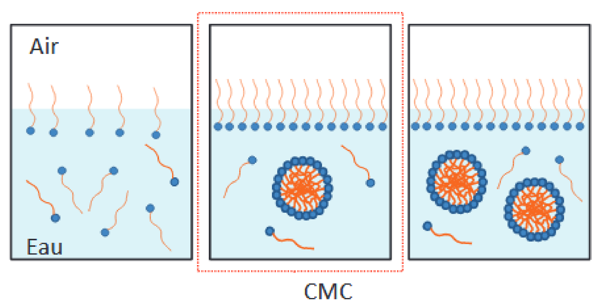

# 08 – Propriétés des tensioactifs en solution 📖 Trace écrite

**Comportement en solution aqueuse – Micelles – Concentration micellaire critique (CMC)**

---

## 1️⃣ Tensioactifs en solution aqueuse

Lorsqu’un tensioactif est introduit dans l’eau, son comportement dépend de sa **concentration en solution**.

À faible concentration, les molécules de tensioactif sont **dispersées individuellement** dans l’eau et peuvent se positionner aux interfaces.

Les propriétés physico-chimiques de la solution évoluent alors progressivement en fonction de la concentration en tensioactif.

---

## 2️⃣ Organisation moléculaire des tensioactifs

Un tensioactif est une **molécule amphiphile**, possédant :

- une **partie hydrophile**, attirée par l’eau,
- une **partie hydrophobe**, attirée par les corps gras.

Lorsque la concentration en tensioactif augmente, les molécules ne restent pas indéfiniment dispersées : elles peuvent s’auto-organiser en structures particulières.

---

## 3️⃣ Formation des micelles

À partir d’une certaine concentration, les molécules de tensioactif s’organisent en **micelles**.

Une **micelle** est une structure dans laquelle :

- les parties hydrophobes des molécules sont regroupées vers l’intérieur,
- les parties hydrophiles sont orientées vers l’extérieur, au contact de l’eau.

La formation de micelles modifie le comportement global de la solution.

---

## 4️⃣ Concentration micellaire critique (CMC)

La **concentration micellaire critique (CMC)** correspond à la **concentration minimale en tensioactif à partir de laquelle les micelles commencent à se former** en solution aqueuse.

Sur un graphique représentant l’évolution d’une propriété physico-chimique en fonction de la concentration en tensioactif, la CMC se traduit par une **rupture de comportement** ou un **changement de pente**.

---

## 5️⃣ Comportement de la solution avant et après la CMC

- **En dessous de la CMC** : les molécules de tensioactif sont principalement dispersées individuellement dans l’eau.

- **Au-dessus de la CMC** : les molécules s’organisent majoritairement en micelles.

Ce changement d’organisation explique l’évolution différente des propriétés physico-chimiques de la solution.

---

## 6️⃣ Intérêt de la CMC en cosmétologie

La notion de CMC est essentielle en cosmétologie car elle permet :

- d’assurer une **efficacité lavante optimale**,
- de **maîtriser la concentration en tensioactif** dans un produit,
- d’éviter une concentration inutilement élevée,
- de **limiter les risques d’irritation cutanée**.

La CMC constitue donc un **outil de raisonnement en formulation cosmétique**.

---

## 7️⃣ Enjeux professionnels et lien avec l’épreuve E2

La compréhension du comportement des tensioactifs en solution est indispensable :

- en **formulation cosmétique**,
- en **contrôle qualité**,
- lors de l’analyse de **résultats expérimentaux fournis**,
- pour la **justification des choix de concentration**.

À l’épreuve **E2 – Expertise scientifique et technologique**, le candidat doit être capable de :

- interpréter un **graphique scientifique**,
- identifier une **rupture de comportement**,
- relier un résultat expérimental à une **explication moléculaire**,
- argumenter de manière **scientifique et professionnelle**.

---

### ✅ À retenir

- Le comportement d’un tensioactif dépend de sa **concentration en solution**
- Les molécules peuvent s’organiser en **micelles**
- La **CMC** correspond à une concentration seuil
- La CMC est un **outil clé en formulation cosmétique**
- Une concentration trop élevée n’est pas nécessairement plus efficace

---

## 🔗 Transition vers la suite

Ces notions seront réinvesties pour :

- l’analyse de **graphiques et résultats expérimentaux**,
- la compréhension des **choix de formulation cosmétique**,
- la préparation progressive à l’épreuve  **E2 – Expertise scientifique et technologique**.
