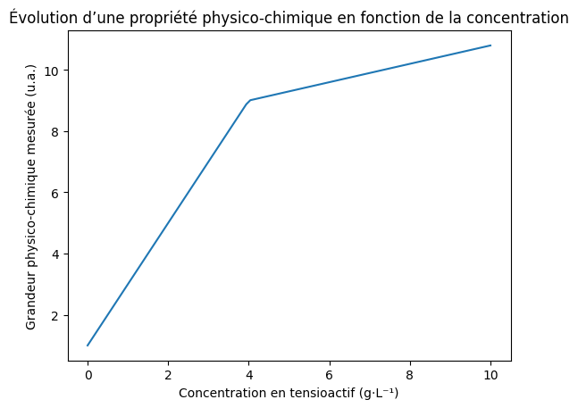

# S08 – Propriétés des tensioactifs en solution 📝

**CMC – Comportement en solution – Pouvoir moussant – Solubilisation**

> En cosmétologie, un tensioactif ne se comporte pas de la même manière selon sa concentration en solution. Comprendre ce comportement est essentiel pour la **formulation**, l'**efficacité** et la **tolérance cutanée** des produits lavants. Cette séance prépare directement l'interprétation de graphiques à l'épreuve **E2**.

---

## 🎯 Objectifs de la séance

À l'issue de cette séance, vous serez capables de :

- expliquer le **comportement d'un tensioactif en solution aqueuse**,
- définir la **concentration micellaire critique (CMC)**,
- interpréter un **graphique expérimental de type CMC**,
- expliquer le **pouvoir moussant** et la **solubilisation** par les micelles,
- relier la CMC à des **conséquences pratiques en formulation**.

---

## 🧴 Situation professionnelle

Vous travaillez dans un **laboratoire cosmétique**. Lors du développement d'un gel douche, le formulateur doit choisir la **concentration optimale** en tensioactif. Trop peu : le produit ne lave pas. Trop : irritation cutanée. Votre mission : comprendre comment un tensioactif se comporte en solution pour **justifier scientifiquement** le choix de concentration.

---

## 📄 Documents supports

### Document 1 – Graphique : conductivité en fonction de la concentration en tensioactif

### Document 2 – Organisation moléculaire en solution

- À **faible concentration** : les molécules de tensioactif sont dispersées individuellement (monomères) et se placent aux interfaces eau/air.
- À partir de la **CMC** : les interfaces sont saturées, les molécules s'organisent en **micelles** dans le volume de la solution.

### Document 3 – Propriétés des solutions de tensioactifs

| Propriété | Sous la CMC | Au-dessus de la CMC |
|-----------|-------------|---------------------|
| Organisation moléculaire | Monomères dispersés, interface | Micelles dans le volume |
| Tension superficielle | Diminue fortement | Se stabilise (plateau) |
| Conductivité (TA ioniques) | Augmente fortement | Augmente plus lentement |
| Pouvoir moussant | Faible | Maximal (mousse stable) |
| Pouvoir de solubilisation | Très faible | Élevé (piégeage dans les micelles) |
| Détergence (nettoyage) | Insuffisante | Efficace |

### Document 4 – CMC de quelques tensioactifs cosmétiques (25 °C)

| Tensioactif | Famille | CMC (mmol/L) | CMC (g/L) |
|------------|---------|:------------:|:---------:|
| Sodium Lauryl Sulfate (SLS) | Anionique | 8,2 | 2,4 |
| Sodium Laureth Sulfate (SLES) | Anionique | 1,0 | 0,4 |
| Cocamidopropyl Betaine | Amphotère | 0,97 | 0,34 |
| Decyl Glucoside | Non ionique | 2,2 | 0,7 |

---

## TRONC COMMUN

---

### 🧠 Travail 1 – Lecture du graphique CMC (Document 1)

**a)** Décrivez l'évolution générale de la conductivité lorsque la concentration en tensioactif augmente :

    

**b)** Peut-on distinguer **plusieurs zones de comportement** sur le graphique ?

☐ Oui     ☐ Non

Si oui, décrivez chaque zone :

    

---

### 📘 Travail 2 – Identification de la CMC

**a)** Repérez sur le graphique la concentration à laquelle le comportement change. Valeur approximative :

  

**b)** Cette concentration correspond à :

☐ La concentration maximale autorisée
☐ La **concentration micellaire critique (CMC)**
☐ La concentration limite de solubilité

Justifiez :

    

---

### 🔬 Travail 3 – Organisation moléculaire (Document 2)

**a)** Expliquez ce qu'est une **micelle** :

    

**b)** Complétez :

> Sous la CMC, les molécules de tensioactif sont principalement .......................... .
> Au-dessus de la CMC, les molécules s'organisent en .......................... .

**c)** Pourquoi la conductivité augmente-t-elle **moins vite** après la CMC ? (Pour un TA ionique)

    

---

### 🧪 Travail 4 – CMC et propriétés (Document 3)

**a)** Complétez le tableau en indiquant si chaque propriété est **faible** ou **élevée** :

| Propriété | Sous la CMC | Au-dessus de la CMC |
|-----------|:-----------:|:-------------------:|
| Pouvoir moussant | .......... | .......... |
| Pouvoir de solubilisation | .......... | .......... |
| Détergence | .......... | .......... |

**b)** Expliquez pourquoi le **pouvoir de solubilisation** augmente fortement au-dessus de la CMC :

*Aide : pensez à la structure de la micelle (intérieur hydrophobe).*

     

---

## TD DIFFÉRENCIÉ – CMC et formulation cosmétique

> **Choisissez votre niveau** :
>
> ⭐ **Niveau 1** – Guidé : questions décomposées avec aides
>
> ⭐⭐ **Niveau 2** – Standard : interprétation + raisonnement formulation
>
> ⭐⭐⭐ **Niveau 3** – Expert : comparaison de tensioactifs + argumentation E2

---

### ⭐ Niveau 1 – Guidé

**a)** Un formulateur prépare un gel douche avec du SLS. D'après le Document 4, la CMC du SLS est de .......... g/L.

**b)** S'il utilise une concentration de **1 g/L** de SLS, sera-t-il au-dessus ou en dessous de la CMC ?

☐ Au-dessus     ☐ En dessous

**c)** À cette concentration, le produit sera-t-il efficace pour laver ? Justifiez :

☐ Oui, car les micelles sont formées
☐ Non, car on est sous la CMC donc pas de micelles

**d)** S'il utilise **5 g/L** de SLS, sera-t-il au-dessus de la CMC ?

☐ Oui     ☐ Non

**e)** Complétez :

> Pour qu'un produit lavant soit efficace, la concentration en tensioactif doit être .......................... la CMC. Mais augmenter la concentration bien au-delà de la CMC n'améliore pas .......................... l'efficacité et risque d'augmenter l'.......................... cutanée.

---

### ⭐⭐ Niveau 2 – Standard

**a)** D'après le Document 4, comparez les CMC du SLS et du SLES. Lequel forme des micelles à plus faible concentration ?

   

**b)** Un formulateur hésite entre 3 g/L de SLS et 3 g/L de SLES pour un gel douche.

Pour chaque tensioactif à 3 g/L, indiquez :
- s'il est au-dessus ou en dessous de sa CMC,
- si le produit sera efficace,
- le niveau de tolérance cutanée attendu.

| Tensioactif à 3 g/L | Rapport à la CMC | Efficacité | Tolérance |
|---------------------|:-----------------:|:----------:|:---------:|
| SLS (CMC = 2,4 g/L) | .......... | .......... | .......... |
| SLES (CMC = 0,4 g/L) | .......... | .......... | .......... |

**c)** Un étudiant affirme : *« Plus on met de tensioactif, plus le produit est efficace. »*

Rédigez une réponse argumentée (4-5 lignes) montrant que cette affirmation est incorrecte, en vous appuyant sur la notion de CMC.

      

**d)** Expliquez en 2-3 lignes pourquoi un produit lavant doit contenir un tensioactif au-dessus de sa CMC pour **solubiliser** les corps gras.

    

---

### ⭐⭐⭐ Niveau 3 – Expert

**a)** D'après le Document 4, classez les 4 tensioactifs par **CMC croissante** :

1. .......................... (CMC la plus basse)
2. ..........................
3. ..........................
4. .......................... (CMC la plus haute)

**b)** La Cocamidopropyl Betaine a une CMC extrêmement basse (0,01 g/L). Pourtant, on ne l'utilise jamais seule dans un gel douche. Proposez au moins **deux raisons** :

     

**c)** Situation E2 – Un laboratoire développe un shampooing pour **cuir chevelu sensible**. Les résultats d'un test de CMC montrent le graphique suivant pour le tensioactif choisi (Sodium Cocoyl Glutamate) :

| Concentration (g/L) | 0 | 0,5 | 1,0 | 1,5 | 2,0 | 2,5 | 3,0 | 4,0 | 5,0 |
|---------------------|:-:|:---:|:---:|:---:|:---:|:---:|:---:|:---:|:---:|
| Conductivité (µS/cm) | 0 | 85 | 170 | 240 | 280 | 295 | 305 | 320 | 330 |

Tracez mentalement la courbe. Estimez la CMC à partir de ces données :

CMC ≈ .......... g/L

Justification (décrivez le changement de pente) :

    

**d)** Le formulateur envisage une concentration finale de **8 g/L** dans le shampooing. Rédigez un **paragraphe argumenté (6-8 lignes)** pour le conseiller. Abordez :
- le rapport à la CMC,
- l'efficacité de détergence et de solubilisation,
- la tolérance cutanée pour un cuir chevelu sensible,
- une recommandation de concentration.

          

---

## STRUCTURATION

### 🧾 Trace écrite – À compléter

**Micelle** :

    

**Concentration micellaire critique (CMC)** :

    

**Propriétés au-dessus de la CMC** (pouvoir moussant, solubilisation, détergence) :

    

**Intérêt de la CMC en formulation cosmétique** :

    

---

### 🔗 Pour la suite

La notion de CMC sera réinvestie dans le TP de conductimétrie (détermination expérimentale de la CMC) et dans les analyses de formulations.
