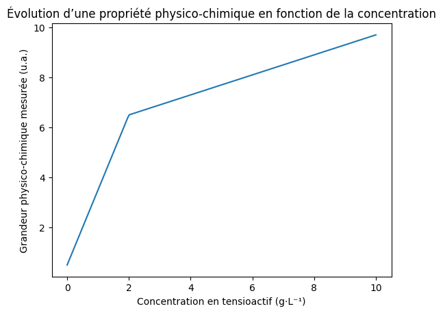

# 08 – Propriétés des tensioactifs en solution  
## 🖊️ Évaluation formative

**Analyser un graphique CMC et argumenter un raisonnement cosmétologique**

⏱️ Durée : 30 minutes  
🎯 Objectif : évaluer la capacité de l’étudiant à **analyser un document scientifique**, **interpréter un comportement en solution**, et **argumenter à partir de la notion de CMC**, conformément aux attendus de l’épreuve **E2 – Expertise scientifique et technologique**.

📌 Barème indicatif : /20

---

## 📌 Statut de l’évaluation (E2)

Cette évaluation ne vise pas la restitution du cours.  
Elle évalue la capacité de l’étudiant à :

- analyser un **graphique scientifique fourni**,
- identifier une **rupture de comportement**,
- mobiliser la notion de **concentration micellaire critique (CMC)**,
- relier un résultat expérimental à une **explication moléculaire**,
- **argumenter** une réponse de manière scientifique.

Toute réponse non justifiée ou uniquement affirmative sera considérée comme **incomplète**.

---

## 🧴 Situation professionnelle

Vous travaillez dans un **laboratoire cosmétique / service formulation**.

Lors du développement d’un produit lavant, vous devez vérifier que la **concentration en tensioactif choisie est cohérente** avec le comportement du tensioactif en solution.

Pour cela, vous analysez un **graphique expérimental** représentant l’évolution d’une propriété physico-chimique en fonction de la concentration en tensioactif.

---

## Exercice 1 – Lecture et description du graphique  
### (4 points)

À partir du **Document 1**, répondez aux questions suivantes.

1. Décrivez l’évolution générale de la grandeur physico-chimique mesurée lorsque la concentration en tensioactif augmente.

 
 
 
 

2. Le graphique met-il en évidence **plusieurs zones de comportement** ?

☐ Oui  ☐ Non  

Si oui, indiquez le nombre de zones observées et décrivez-les brièvement.

 
 
 
 

---

## Exercice 2 – Mise en évidence de la CMC  
### (4 points)

3. Repérez sur le graphique une **concentration particulière** pour laquelle le comportement de la courbe change.

Indiquez :

- la valeur approximative de cette concentration,
- ce que vous observez sur la courbe.

 
 
 
 

4. Cette concentration correspond à :

☐ une concentration maximale  
☐ une concentration micellaire critique (CMC)  
☐ une concentration limite réglementaire  

Justifiez votre réponse.

 
 
 
 

---

## Exercice 3 – Interprétation moléculaire  
### (6 points)

5. Expliquez ce qui se passe, au niveau **moléculaire**, lorsque la concentration en tensioactif dépasse la valeur identifiée à la question précédente.

Votre réponse devra faire apparaître :

- l’organisation des molécules,
- la notion de micelles.

 
 
 
 
 
 

---

## Exercice 4 – Raisonnement cosmétologique  
### (attendus BTS / E2) (4 points)

Un formulateur propose d’augmenter fortement la concentration en tensioactif au-delà de la valeur identifiée sur le graphique, afin d’améliorer l’efficacité du produit lavant.

Expliquez si ce raisonnement est **scientifiquement pertinent**.

Vous devez argumenter en vous appuyant sur :

- la notion de **CMC**,
- l’efficacité du produit,
- la maîtrise de la concentration en tensioactif.

Rédigez une réponse structurée (4 à 6 lignes).

 
 
 
 
 
 

---

## Exercice 5 – Posture professionnelle et E2  
### (2 points)

Un étudiant écrit :

> « Plus on met de tensioactif, plus le produit est efficace. »

1. Cette affirmation est-elle suffisante pour un **niveau BTS MECP** et pour l’épreuve **E2** ?

☐ Oui  ☐ Non  

2. Citez **deux éléments scientifiques** qui doivent apparaître dans une réponse conforme aux attendus de l’épreuve **E2**.

 
 
 
 

---

## 📎 Documents supports (annexes)

## 📄 Document 1 – Graphique expérimental type CMC

Graphique représentant l’évolution d’une **propriété physico-chimique** en fonction de la **concentration en tensioactif**.

---

## 🔍 Auto-évaluation

Cochez ce qui vous correspond :

☐ Je sais lire un graphique scientifique  
☐ Je sais repérer une rupture de comportement  
☐ Je sais définir et utiliser la notion de CMC  
☐ Je sais relier un résultat à une explication moléculaire  
☐ Je sais argumenter une réponse de niveau E2  
☐ Je dois encore progresser dans l’analyse écrite
