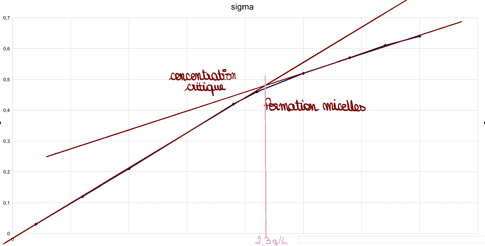

# S09 – TP 1 – Mesure de la CMC par conductimétrie
## Corrigé

## 🧠 PARTIE A – Exploitation documentaire préalable

### 1. Structure du tensioactif SDS

**1\.**  
L’ion dodécylsulfate est constitué :

- d’une **chaîne carbonée longue apolaire**, hydrophobe,
- d’une **tête polaire chargée négativement** (groupement sulfate), hydrophile.

**2\.**  
La tête hydrophile interagit favorablement avec l’eau grâce à sa polarité et à sa charge.
La chaîne hydrophobe, apolaire, évite le contact avec l’eau.

**3\.**  

**3a. Tête**

* Atomes : **beaucoup d’oxygènes (O)**
* Charge : **oui, charge négative (–)**

**3b. Queue**

* Liaisons : **C–C et C–H**
* Caractère : **non polaire**

**3c. Conclusion**

* **La tête est hydrophile** car elle est **chargée** et contient des **O**.
* **La queue est hydrophobe** car elle est une **chaîne C–C / C–H non polaire**.

---

### 2. Organisation en solution aqueuse

**4\.**  
- **En dessous de la CMC** : les ions SDS sont dispersés et **libres en solution**.  
- **Au-dessus de la CMC** : les ions SDS s’assemblent pour former des **micelles**.

**5\.**  
Une micelle est un agrégat de molécules de tensioactif dans lequel les queues hydrophobes sont regroupées au centre, tandis que les têtes hydrophiles sont orientées vers l’eau.
En cosmétologie, les micelles permettent de **piéger et éliminer les salissures grasses**.

---

### 3. Définition de la CMC

**6\.**  
La concentration micellaire critique (CMC) est la **concentration minimale en tensioactif** à partir de laquelle des micelles commencent à se former en solution aqueuse.

**7\.**  
La CMC correspond à une **concentration seuil** car en dessous de cette valeur, les tensioactifs restent libres, tandis qu’au-delà, l’excès de tensioactif s’organise sous forme de micelles.

---

## 🧪 PARTIE B – Manipulation expérimentale

### 4. Protocole expérimental

La solution mère de SDS a une concentration massique :
$C_{mère} = 11,5{g·L}^{-1}$.

Les différentes solutions sont obtenues par **dilution** de cette solution mère dans une fiole jaugée de 50 mL.

---

### 5. Principe de la dilution

**8\.**  
Lors d’une dilution, la quantité de matière de soluté est conservée : la diminution de la concentration est compensée par  l’augmentation du volume.

**9\.**  
Le facteur de dilution $F$ est le rapport entre le volume final et le volume prélevé :
$F = \dfrac{V'}{V}$.

---

### 6. Préparation des solutions

**10\.**  
Les concentrations sont calculées à partir du facteur de dilution :
$C_{fille} = \dfrac{C_{mère}}{F}$.

on a :

- La solution mère de SDS a une concentration massique : $C_{mère} = 11,5{g·L}^{-1}$.
- Les solutions filles de SDS ont un volume de 50 mL 

* **Facteur de dilution** : $F=\dfrac{V_{fille}}{V_{prélevé}}$
* **Concentration** : $C = C_{mère}\times \dfrac{V_{prélevé}}{V_{fille}} = 11,5\times \dfrac{V_{prélevé}}{50}$

| Solution                |   S1 |    S2 |   S3 |   S4 |   S5 |   S6 |   S7 |   S8 |   S9 |
| ----------------------- | ---: | ----: | ---: | ---: | ---: | ---: | ---: | ---: | ---: |
| Volume prélevé (mL)     |  1,0 |   3,0 |  5,0 |  9,5 | 10,5 | 12,5 | 14,5 | 16,0 | 17,5 |
| Facteur de dilution (F) | 50,0 | 16,67 | 10,0 | 5,26 | 4,76 | 4,00 | 3,45 | 3,13 | 2,86 |
| Concentration (g·L⁻¹)   | 0,23 |  0,69 | 1,15 | 2,19 | 2,42 | 2,88 | 3,34 | 3,68 | 4,03 |

**11\.**  
La préparation se fait en prélevant le volume de solution mère à l’aide d’une pipette (jaugée ou graduée), puis en complétant à 50 mL avec de l’eau distillée dans une fiole jaugée,en évitant toute agitation brutale pour limiter la formation de mousse.

---

### 7. Conductivité et concentration

La conductivité $\sigma$ d’une solution ionique est proportionnelle à la **concentration en ions libres** :
$\sigma = k \times C$.

**12\.**  
Tant que les ions sont libres en solution, la courbe $\sigma = f(C)$ est **une droite croissante**.

---

### 8. Mesure de la conductivité

Les valeurs mesurées montrent une augmentation de la conductivité avec la concentration, puis un changement de pente à partir d’une certaine concentration.

---

## 🧠 PARTIE C – Exploitation des résultats

**13\.**  
Le graphique $\sigma = f(C)$ présente deux zones distinctes :
- une zone linéaire à faible concentration,
- une zone où la pente diminue à plus forte concentration.

**14\.**  
La rupture de pente correspond à la **concentration micellaire critique (CMC)**.
La CMC du SDS est déterminée graphiquement et vaut environ :

$CMC \approx 2$ à $3 {g·L}^{-1}$

---

## ✍️ PARTIE D – Interprétation cosmétologique (E2)

**15\.**  
Augmenter fortement la concentration en SDS au-delà de la CMC n’améliore pas significativement l’efficacité lavante, car la concentration en ions libres reste pratiquement constante.

**16. Réponse argumentée (exemple attendu)**  

> Au-delà de la CMC, les molécules de SDS supplémentaires s’assemblent en micelles et n’augmentent plus la concentration en ions libres responsables de la conductivité.
> L’efficacité lavante n’augmente donc pas proportionnellement.
> De plus, une concentration trop élevée en tensioactif peut entraîner une irritation cutanée. En formulation cosmétique, on cherche donc à se placer **légèrement au-dessus de la CMC**, afin d’assurer l’efficacité tout en limitant les effets indésirables.

---

## 🧾 Conclusion

La concentration micellaire critique du SDS correspond à la concentration seuil à partir de laquelle les micelles se forment.
Elle permet d’optimiser l’efficacité lavante des produits cosmétiques tout en maîtrisant leur tolérance cutanée.

---
