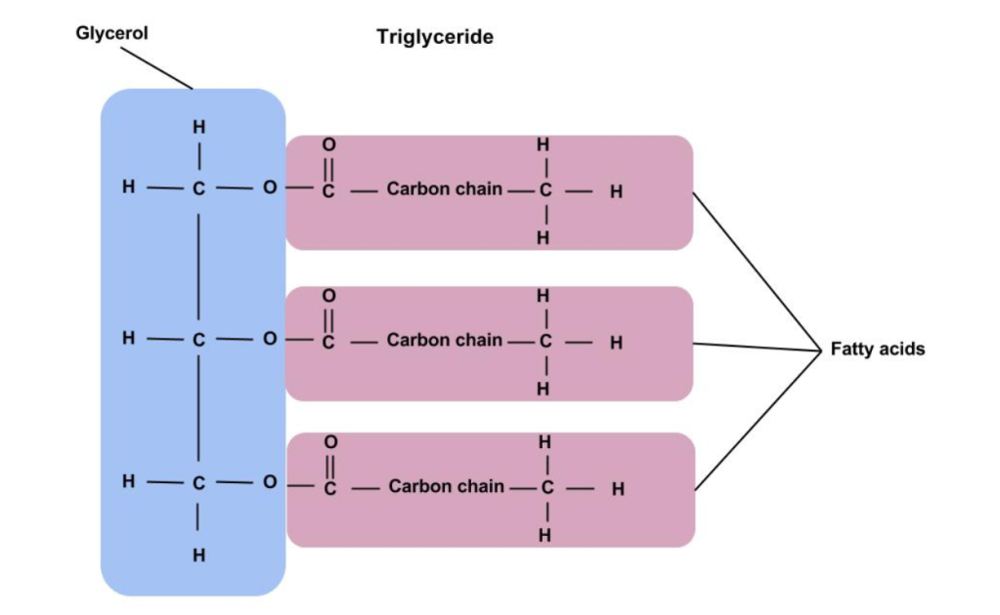
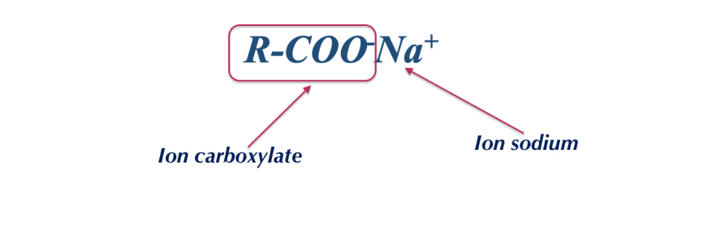

# S13 – Exploitation du TP savon 📝

**pH – Propriétés – Structure – Usage**

> Après avoir fabriqué un savon en TP, il faut maintenant **analyser les résultats**, **interpréter les mesures** et **rédiger une exploitation scientifique structurée**. Cette compétence est indispensable à l'épreuve E2.

---

## 🎯 Objectifs de la séance

À l'issue de cette séance, vous serez capables de :

- interpréter la **mesure du pH** d'un savon,
- expliquer pourquoi le savon a un **pH alcalin**,
- relier la **structure chimique** du savon à ses **propriétés lavantes** et ses **limites**,
- identifier les **familles fonctionnelles** impliquées dans la saponification,
- comparer des **formules INCI** de savons (industriel vs artisanal),
- rédiger une **exploitation structurée** (introduction → résultats → interprétation → conclusion).

---

## 📎 Documents supports

### 📄 Document 1 – Résultats du TP (S12)

| Paramètre | Résultat attendu | Vos résultats |
|-----------|:----------------:|:-------------:|
| Aspect du savon après cure | Solide, couleur crème-beige | |
| Consistance | Ferme, se coupe au couteau | |
| Odeur | Légère, huile d'olive | |
| **pH (dilution 1 % dans l'eau)** | **9 à 10** | |
| Mousse au frottement | Oui, mousse fine | |

**Rappel** : le pH de la peau est de **5,5** (légèrement acide).

---

### 📄 Document 2 – Du triglycéride au savon : les familles fonctionnelles

| Molécule | Formule générale | Famille fonctionnelle | Rôle dans la saponification |
|----------|:----------------:|----------------------|----------------------------|
| Triglycéride |  | **Ester** | Réactif (corps gras) |
| Soude | NaOH | Base forte | Réactif |
| Savon |  | **Carboxylate** (sel d'acide carboxylique) | Produit principal |
| Glycérol | HOCH₂-CHOH-CH₂OH | **Triol** (polyol, 3 fonctions alcool) | Sous-produit |

**Pourquoi le savon est basique** : le savon est le sel d'un **acide faible** (l'acide gras R-COOH) et d'une **base forte** (NaOH). En solution aqueuse, l'ion carboxylate R-COO⁻ capte un proton H⁺ de l'eau, ce qui libère des ions OH⁻ → **pH > 7**.

---

### 📄 Document 3 – Les 3 étapes du pouvoir lavant

| Étape | Ce qui se passe | Rôle de la structure amphiphile |
|:-----:|----------------|-------------------------------|
| **1** | Le savon forme des **micelles** dans l'eau (au-dessus de la CMC) | Têtes hydrophiles vers l'eau, queues lipophiles au centre |
| **2** | Les micelles **entourent** la salissure grasse | Les queues lipophiles s'immergent dans la graisse |
| **3** | La salissure est **emportée** dans l'eau de rinçage | Les têtes hydrophiles rendent l'ensemble soluble dans l'eau |

---

### 📄 Document 4 – Comparaison de 3 formules INCI de savons

**Savon A** – Savon industriel classique (Lane Paris)
```
Sodium Tallowate, Sodium Cocoate, Aqua, Glycerin, Parfum,
Sodium Chloride, Titanium Dioxide, Tetrasodium Etidronate
```

**Savon B** – Savon artisanal bio (En Douce Heure, saponification à froid)
```
Sodium Olivate, Sodium Cocoate, Glycerin, Aqua,
Sodium Shea Butterate, Avena Sativa Kernel Flour
```

**Savon C** – Savon bio industriel (N-Ki)
```
Sodium Palmate, Sodium Palm Kernelate, Rosmarinus Leaf Aqua,
Dehydroacetic Acid, Benzyl Alcohol, Parfum, Glycerin,
Sodium Chloride, Tocopherol, Citric Acid, Linalool, Limonene
```

---

### 📄 Document 5 – Additifs fréquents dans les savons

| Additif (INCI) | Rôle | Exemple |
|----------------|------|---------|
| Tetrasodium Etidronate / Tetrasodium EDTA | **Agent chélateur** : piège Ca²⁺ et Mg²⁺ pour éviter la précipitation du savon en eau dure | Savon A |
| Titanium Dioxide | **Colorant** (opacifiant blanc) | Savon A |
| Tocopherol | **Antioxydant** (vitamine E) : protège les huiles de l'oxydation | Savon C |
| Sodium Chloride | **Agent de texture** (durcisseur) | Savons A, C |
| Linalool, Limonene | **Allergènes** à déclaration obligatoire (issus du parfum) | Savon C |
| Dehydroacetic Acid, Benzyl Alcohol | **Conservateurs** | Savon C |
| Avena Sativa Kernel Flour | **Actif** (farine d'avoine, apaisant) | Savon B |

---

## TRONC COMMUN

---

### 🧠 Travail 1 – Mesure et interprétation du pH

**a)** Reportez votre mesure de pH dans le Document 1. Si la mesure n'a pas été faite, utilisez la valeur de référence : **pH = 9,5**.

**b)** Le pH de votre savon est-il acide, neutre ou basique ? Justifiez.

<br><br>

**c)** Complétez :

> Le savon est basique car c'est le sel d'un acide .......................... (l'acide gras) et d'une base .......................... (NaOH). En solution, l'ion .......................... capte un H⁺ de l'eau → libération d'ions .......................... → pH > 7.

**d)** Le pH de la peau est de 5,5. Calculez l'écart de pH entre votre savon et la peau :

Écart = .......... – .......... = ..........

**e)** Quelles conséquences cet écart peut-il avoir pour la peau lors d'un usage fréquent ?

<br><br><br>

---

### 📘 Travail 2 – Structure et pouvoir lavant

**a)** Identifiez la famille fonctionnelle de chaque molécule :

| Molécule | Famille fonctionnelle |
|----------|----------------------|
| Triglycéride (corps gras) | |
| Savon (R-COO⁻ Na⁺) | |
| Glycérol (3 × OH) | |

**b)** Pourquoi le savon est-il un **tensioactif** ? Identifiez sa partie hydrophile et sa partie lipophile.

<br><br><br>

**c)** Décrivez les **3 étapes** du pouvoir lavant du savon (Document 3) :

Étape 1 :

<br><br>

Étape 2 :

<br><br>

Étape 3 :

<br><br>

---

### 🔬 Travail 3 – Comparaison des formules INCI (Documents 4 et 5)

**a)** Pour chaque savon, identifiez le(s) **savon(s)** (carboxylates de sodium) présents :

| | Savon A | Savon B | Savon C |
|---|---------|---------|---------|
| Savon(s) INCI | | | |
| Origine des huiles | | | |

**b)** Le **Tetrasodium Etidronate** (Savon A) est un agent chélateur. Quel problème résout-il ?

<br><br><br>

**c)** Le Savon B (artisanal, à froid) contient de la glycérine mais **pas de conservateur**. Pourquoi ?

<br><br><br>

**d)** Quels **allergènes** sont déclarés dans le Savon C ? D'où proviennent-ils ?

<br><br>

**e)** Votre savon fabriqué en TP (S12) ressemble-t-il davantage au Savon A, B ou C ? Justifiez en 2-3 lignes.

<br><br><br><br>

---

## TD DIFFÉRENCIÉ – Rédiger une exploitation structurée

> **Choisissez votre niveau** :
>
> ⭐ **Niveau 1** – Guidé : textes à trous + plan fourni
>
> ⭐⭐ **Niveau 2** – Standard : exploitation structurée guidée (6-8 lignes)
>
> ⭐⭐⭐ **Niveau 3** – Expert : exploitation complète type E2 (8-10 lignes)

---

### ⭐ Niveau 1 – Guidé

**a)** Complétez le bilan du TP :

> Le savon fabriqué par saponification à froid est un savon .......................... à .......................... %. Il contient du .......................... (carboxylate de sodium), de la .......................... (humectant) et des huiles non saponifiées.

**b)** Le pH mesuré est de .......... . Ce pH est .......................... (acide / basique). Le pH de la peau est de .......... . L'écart est de .......... unités.

**c)** Cet écart de pH peut provoquer :

☐ Hydratation de la peau
☐ Altération du film hydrolipidique
☐ Sécheresse et tiraillements
☐ Aucun effet

**d)** Le savon fabriqué est-il adapté à un usage quotidien sur peau sensible ?

☐ Oui     ☐ Non

Complétez : Le savon n'est pas adapté car son pH .......................... est trop éloigné du pH de la .......................... . Pour les peaux sensibles, un .......................... (savon sans savon) serait plus adapté.

---

### ⭐⭐ Niveau 2 – Standard

Rédigez une **exploitation structurée** du TP savon (6-8 lignes) en suivant le plan :

**Introduction** (1-2 lignes) : qu'avez-vous fabriqué ? Par quelle méthode ?

<br><br>

**Résultats** (1-2 lignes) : aspect, pH mesuré, mousse.

<br><br>

**Interprétation** (2-3 lignes) : pourquoi le pH est alcalin ? Quelles conséquences pour la peau ?

<br><br><br>

**Conclusion** (1-2 lignes) : le savon est-il cohérent avec un usage quotidien ? Quelle alternative pour peau sensible ?

<br><br><br>

---

### ⭐⭐⭐ Niveau 3 – Expert

Rédigez une **exploitation complète type E2** (8-10 lignes) qui :

- présente le **produit fabriqué** (savon surgras, méthode à froid, composition),
- analyse les **résultats** (pH, aspect, mousse),
- **interprète** le pH alcalin (lien structure chimique R-COO⁻ + acide faible/base forte),
- **compare** votre savon avec les 3 formules INCI du Document 4 (similitudes, différences, additifs),
- **conclut** sur les avantages et limites du savon artisanal vs industriel, et recommande une **alternative** pour les peaux sensibles.

**Mots obligatoires** : *carboxylate, pH alcalin, film hydrolipidique, glycérine, surgras, syndet, micelles*

**Fiches méthode utiles** : 

- ➡️ [FM01 – Justifier (O.A.C.J.)](../Methodologie/01_fiche_methode.md)  

- ➡️ [FM04 – Structurer une réponse rédigée type E2](../Methodologie/04_fiche_methode.md) 

- ➡️ [FM06 – Analyser une liste INCI](../Methodologie/06_fiche_methode.md)  


<br><br><br><br><br><br><br><br><br><br><br><br>

---

## 🧾 Trace écrite – À compléter

**Familles fonctionnelles dans la saponification** :

| Molécule | Famille |
|----------|---------|
| Triglycéride | .......... |
| Savon | .......... |
| Glycérol | .......... |

**Pourquoi le savon est basique** :

<br><br><br>

**Pouvoir lavant** :

<br><br><br>

**Limites du savon** :

<br><br><br>

**Règle d'or** :

> Interpréter des résultats, c'est donner du .......................... à une mesure en la reliant à des .......................... scientifiques.

---

### 🔗 Pour la suite

Cette séance clôture le bloc 1. La prochaine séance sera l'évaluation finale portant sur l'ensemble des notions S01-S13.
