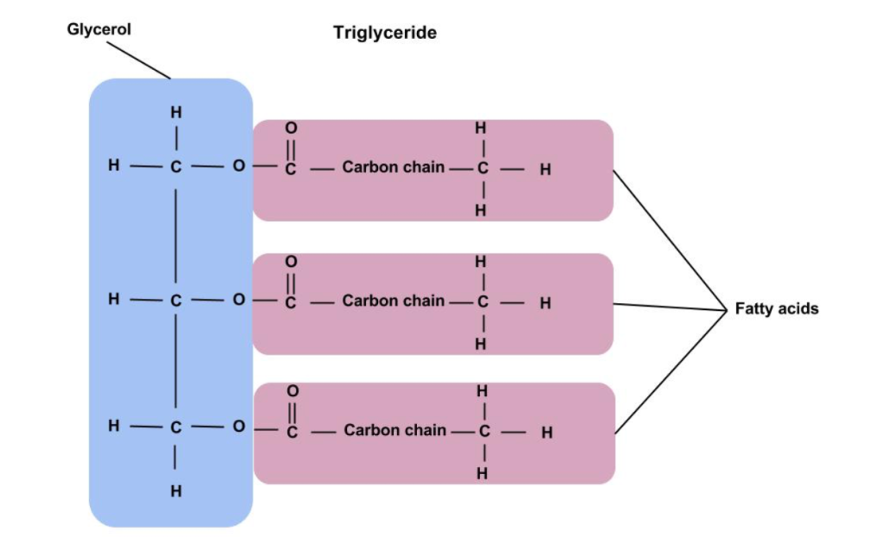
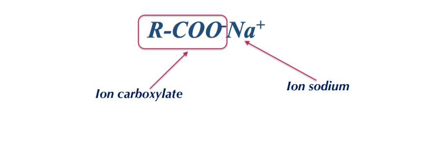

# S13 – Exploitation du TP savon 📖 Trace écrite

---

## 1️⃣ Familles fonctionnelles dans la saponification

La saponification met en jeu trois familles fonctionnelles :

| Molécule | Formule | Famille | Rôle |
|----------|---------|---------|------|
| **Triglycéride** |  | **Ester** | Réactif (corps gras) |
| **Savon** |  | **Carboxylate** | Produit (tensioactif anionique) |
| **Glycérol** | HOCH₂-CHOH-CH₂OH | **Triol (polyol)** | Sous-produit (humectant) |

La saponification est l'**hydrolyse basique** d'un ester (triglycéride) par une base forte (NaOH).

---

## 2️⃣ Le pH du savon

Le savon a un **pH alcalin** (9-10).

**Explication chimique** : le savon est le sel d'un **acide faible** (acide gras R-COOH) et d'une **base forte** (NaOH). En solution aqueuse, l'ion carboxylate R-COO⁻ réagit avec l'eau en captant un H⁺, ce qui libère des ions OH⁻ → pH > 7.

**Conséquence cosmétique** : le pH cutané est d'environ **5,5**. L'écart de 3,5 à 4,5 unités avec le savon perturbe le film hydrolipidique, pouvant provoquer sécheresse et tiraillements.

---

## 3️⃣ Pouvoir lavant du savon

Le savon est un **tensioactif anionique** de structure amphiphile :

- **Tête hydrophile** : COO⁻ Na⁺ (polaire)
- **Queue lipophile** : chaîne carbonée R (apolaire, C₁₂-C₁₈)

**Les 3 étapes du lavage** :

1. Au-dessus de la CMC, le savon forme des **micelles** dans l'eau
2. Les queues lipophiles des micelles **entourent** la salissure grasse
3. La salissure est **emportée** dans l'eau de rinçage grâce aux têtes hydrophiles

---

## 4️⃣ Limites du savon

| Limite | Cause | Conséquence |
|--------|-------|-------------|
| **pH alcalin** | Sel d'acide faible + base forte | Dessèchement, irritation |
| **Eau dure** | Ca²⁺ et Mg²⁺ précipitent le carboxylate | Dépôts, perte de mousse |
| **Eau acide** | L'ion carboxylate reforme l'acide gras | Perte de pouvoir lavant |
| **Eau salée** | Agglomération du savon | Inefficacité |

**Solutions** : agents chélateurs (EDTA), savon surgras, syndet (pH ajustable).

---

## 5️⃣ Lecture INCI d'un savon

- Les noms « **Sodium Olivate** », « **Sodium Cocoate** », « **Sodium Tallowate** » désignent les **savons** (carboxylates de sodium) issus de différentes huiles
- **Glycerin** = glycérine naturelle (conservée si méthode à froid, ajoutée si méthode à chaud)
- **Tetrasodium EDTA / Etidronate** = agent chélateur (contre l'eau dure)
- **Tocopherol** = vitamine E (antioxydant)
- Les allergènes du parfum (Linalool, Limonene…) sont déclarés individuellement

---

## 6️⃣ Rédiger une exploitation structurée

Une exploitation de résultats suit toujours **4 étapes** :

| Étape | Contenu | Exemple |
|-------|---------|---------|
| **Introduction** | Ce qu'on a fait | « Nous avons fabriqué un savon surgras par saponification à froid » |
| **Résultats** | Ce qu'on a mesuré/observé | « Le pH est de 9,5, le savon est solide, crème, avec une mousse fine » |
| **Interprétation** | Pourquoi ces résultats | « Le pH alcalin s'explique par la nature du carboxylate (sel d'acide faible + base forte) » |
| **Conclusion** | Ce qu'on en déduit | « Le savon est efficace mais inadapté aux peaux sensibles ; un syndet serait préférable » |

---

## 🎓 Message clé

> Interpréter un résultat, c'est lui donner du **sens** en le reliant à des **connaissances scientifiques**. En E2, une mesure sans interprétation ne vaut rien.

---

## 🔗 Fiches méthode associées

- ➡️ [**FM01 – Justifier (O.A.C.J.)**](../Methodologie/01_fiche_methode.md) : pour toute réponse argumentée
- ➡️ [**FM03 – Interpréter un graphique ou un tableau**](../Methodologie/03_fiche_methode.md) : pour les mesures de pH
- ➡️ [**FM04 – Structurer une réponse rédigée type E2**](../Methodologie/04_fiche_methode.md) : pour l'exploitation
- ➡️ [**FM06 – Analyser une liste INCI**](../Methodologie/06_fiche_methode.md) : pour la comparaison des formules

---

## 🔗 Pour la suite

Cette séance clôture le bloc 1 (produit cosmétique, tensioactifs, formulation lavante). L'évaluation finale portera sur l'ensemble des notions S01-S13.
