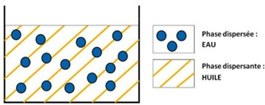

# S14 – Les formes cosmétiques 📝

**Solutions, gels, émulsions et autres dispersions**

> En institut, en laboratoire ou en service qualité, identifier la **forme galénique** d'un produit est une compétence fondamentale. Elle permet de comprendre la formule, d'anticiper le comportement du produit et de conseiller le bon usage. En E2, c'est une question quasi systématique.

---

## 🎯 Objectifs de la séance

À l'issue de cette séance, vous serez capables de :

- distinguer les **formes homogènes** (solutions, gels) et les **formes hétérogènes** (dispersions),
- identifier les **4 grandes familles** de formes galéniques (solution, gel, émulsion, solide),
- connaître la **composition type** de chaque forme (excipient, stabilisant),
- relier la **forme galénique** à l'**usage** du produit et à la **cible**,
- reconnaître une forme galénique à partir d'une **description** ou d'une **liste INCI**,
- distinguer les émulsions **H/E**, **E/H**, **multiples** et les **microémulsions**.

---

## 📎 Documents supports

### 📄 Document 1 – Classification des formes cosmétiques

| Catégorie | Définition | Exemples de formes |
|-----------|------------|-------------------|
| **Formes homogènes** | Mélange d'une seule phase visible, substances miscibles | Solutions vraies, gels (solutions colloïdales) |
| **Formes hétérogènes (dispersions)** | Mélange d'au moins 2 substances non miscibles, stabilisé | Émulsions, suspensions, mousses, aérosols, poudres |

**Vocabulaire clé** :
- **Phase dispersante** (continue) : la phase externe, la plus abondante
- **Phase dispersée** (discontinue) : répartie sous forme de gouttelettes ou particules dans la phase dispersante
- **Stabilisant** : substance qui maintient le mélange stable dans le temps

---

### 📄 Document 2 – Les formes homogènes

| Forme | Composition | Caractéristiques | Exemples cosmétiques |
|-------|-------------|-----------------|---------------------|
| **Solution vraie** | Solvant + soluté, miscibles | Fluide, transparent, homogène | Lotion tonique, eau florale, solution hydroalcoolique |
| **Solution ionique** | Soluté dissocié en ions dans l'eau | Conductrice (électrolyte) | Solutions pour iontophorèse, amincissants à électrodes |
| **Solution non ionique** | Soluté moléculaire | Non conductrice, fluide | Lotions visage, eaux florales |
| **Gel hydrophile** | Eau + gélifiant (réseau 3D) | Texture « prise », non coulant, frais | Gel coiffant, gel amincissant, gel nettoyant |
| **Oléogel** | Huile + gélifiant lipophile | Anhydre, filmogène, protecteur | Baume à lèvres, cire à épiler |

**Gélifiants fréquents** : carbomer, gomme xanthane, hydroxyéthylcellulose, acrylates crosspolymer, PVP.

---

### 📄 Document 3 – Les émulsions

**Définition** : dispersion de deux liquides **non miscibles** (eau + huile) stabilisée par un **émulsionnant** (tensioactif).

**Composition obligatoire** : phase aqueuse + phase huileuse + émulsionnant (tensioactif)

| Type | Phase dispersante | Phase dispersée | Texture | Rinçage | Exemples |
|------|:--:|:--:|---------|---------|----------|
| **H/E** (huile dans eau) | Eau | Huile | Fluide, légère | Se rince à l'eau | Lait démaquillant, lait corporel, crème de jour |
| **E/H** (eau dans huile) | Huile | Eau | Onctueuse, riche | Ne se rince pas à l'eau | Crème de modelage, cold cream, crème peau sèche |

<p style="text-align:center;">
  
  <br>
  <em>Emulsion H/E</em> <br>
  
  <br>
  <em>Emulsion E/H</em>
</p>


**Émulsions multiples** :
- **E/H/E** : gouttelettes d'huile contenant elles-mêmes de l'eau, dispersées dans l'eau → vectorisation d'actifs hydrophiles
- **H/E/H** : gouttelettes d'eau contenant de l'huile, dispersées dans l'huile

**Microémulsions** : particules si fines que le mélange paraît transparent. Concentration en TA 4 à 5 fois supérieure. Elles **peuvent favoriser la pénétration cutanée** de certains actifs (selon la formulation), avec vigilance sur la tolérance.

**Instabilité** : une émulsion est par nature instable. Les gouttelettes grossissent et finissent par se séparer → **coalescence** (rupture de l'émulsion).

<p style="text-align:center;">
  
  <br>
  <em>Coalescence de l'émulsion</em> 

</p>
---

### 📄 Document 4 – Les autres dispersions

| Forme | Phase dispersante | Phase dispersée | Stabilisant | Exemples cosmétiques |
|-------|:-:|:-:|------------|---------------------|
| **Suspension** | Liquide | Solide (fines particules) | Gélifiant | Fond de teint, vernis à ongles, gommage à grains |
| **Mousse** | Liquide / émulsion | Gaz | Émulsionnant + stabilisateur de mousse | Mousse coiffante, fond de teint mousse |
| **Aérosol** | Gaz | Liquide ou solide | Gaz propulseur (propane, butane, azote) | Déodorant spray, shampoing sec, laque |
| **Poudre** | Poudre (pulvérulente) | Poudre (pulvérulente) | Raidisseur d'interface | Poudre libre, fard, blush, terre de soleil |

---

### 📄 Document 5 – Formes spécifiques

| Forme | Définition | Exemples |
|-------|-----------|----------|
| **Sérum** | Solution concentrée en actifs + épaississant, petit volume (10-15 mL) | Sérum hydratant, sérum anti-rides, sérum éclaircissant |
| **Baume** | Pommade anhydre ou émulsion très épaisse, protecteur | Baume à lèvres, baume main, baume capillaire |
| **Onguent** | Pommade contenant des substances résineuses | Onguent réparateur |
| **Patch** | Film adhésif ± actifs (occlusif → favorise pénétration) | Patch points noirs, patch amincissant, patch anticerne |

---

### 📄 Document 6 – Récapitulatif : chaque forme a son stabilisant

| Forme | Stabilisant spécifique | Rôle |
|-------|----------------------|------|
| Émulsion | **Émulsionnant** (tensioactif) | Maintient eau + huile mélangées |
| Gel / Suspension | **Gélifiant** | Emprisonne le solvant dans un réseau 3D / empêche la sédimentation |
| Poudre | **Raidisseur d'interface** | Améliore l'écoulement et limite l'agglomération des poudres |
| Mousse | **Émulsionnant** + stabilisateur de mousse | Maintient le gaz dispersé dans le liquide |

---

## TRONC COMMUN

---

### 🧠 Travail 1 – Classification des formes galéniques

**a)** Complétez le tableau en plaçant chaque forme dans la bonne catégorie :

*Formes à placer : émulsion, gel hydrophile, solution vraie, suspension, mousse, aérosol, oléogel, poudre*

| Formes homogènes (1 phase) | Formes hétérogènes / dispersions (2+ phases) |
|:--:|:--:|
| | |
| | |
| | |
| | |

**b)** Pour chaque forme hétérogène, indiquez la **phase dispersante** et la **phase dispersée** :

| Forme | Phase dispersante | Phase dispersée |
|-------|:-:|:-:|
| Émulsion H/E | | |
| Émulsion E/H | | |
| Suspension | | |
| Mousse | | |
| Aérosol | | |
| Poudre | | |

---

### 📘 Travail 2 – Identification à partir de descriptions

Pour chaque produit, identifiez la **forme galénique** et justifiez par **un indice** :

| Produit | Description | Forme galénique | Indice |
|---------|-------------|:-:|:-:|
| Eau micellaire | Liquide transparent, fluide, aqueux | | |
| Crème de jour | Texture onctueuse blanche, phase grasse + émulsifiants | | |
| Gel coiffant | Texture prise, non coulant, contient du carbomer | | |
| Fond de teint fluide | Liquide opaque, pigments en suspension | | |
| Mousse autobronzante | Texture aérienne, légère, conditionnée en aérosol | | |
| Baume à lèvres | Solide, anhydre, s'applique au doigt ou en stick | | |
| Laque cheveux | Spray, gouttelettes fines dans l'air | | |
| Sérum anti-rides | Fluide visqueux, transparent, petit flacon-pipette | | |

---

### 🔬 Travail 3 – Les émulsions : H/E vs E/H

**a)** Complétez le tableau comparatif :

| Critère | Émulsion H/E | Émulsion E/H |
|---------|:--:|:--:|
| Phase continue (dispersante) | | |
| Phase dispersée | | |
| Texture | | |
| Se rince à l'eau ? | | |
| Exemples (2 minimum) | | |
| Type de peau ciblé | | |

**b)** Un lait démaquillant est-il une émulsion H/E ou E/H ? Justifiez en 2-3 lignes.

<br><br><br>

**c)** Pourquoi une cold cream (crème riche pour peaux sèches) est-elle formulée en E/H plutôt qu'en H/E ?

<br><br><br>

**d)** Les microémulsions ont une concentration en tensioactif 4 à 5 fois plus élevée que les émulsions simples. Quel est l'avantage **potentiel principal** des microémulsions pour la pénétration des actifs ?

<br><br>

---

## TD DIFFÉRENCIÉ – Identifier une forme galénique et la relier à l'usage

> **Choisissez votre niveau** :
>
> ⭐ **Niveau 1** – Guidé : QCM + appariements + texte à trous
>
> ⭐⭐ **Niveau 2** – Standard : analyse de produits + paragraphe argumenté 4-6 lignes
>
> ⭐⭐⭐ **Niveau 3** – Expert : analyse INCI + argumentation E2 6-10 lignes

---

### ⭐ Niveau 1 – Guidé

**a)** Reliez chaque forme galénique à son stabilisant :

| Forme | | Stabilisant |
|-------|-|------------|
| Émulsion | ● | ○ Gélifiant |
| Gel / Suspension | ● | ○ Raidisseur d'interface |
| Poudre | ● | ○ Émulsionnant (tensioactif) |

**b)** Reliez chaque produit à sa forme galénique :

| Produit | | Forme |
|---------|-|-------|
| Lait corporel | ● | ○ Gel hydrophile |
| Gel douche | ● | ○ Suspension |
| Fond de teint fluide | ● | ○ Émulsion H/E |
| Lotion tonique | ● | ○ Aérosol |
| Déodorant spray | ● | ○ Solution |

**c)** Complétez le texte à trous :

> Une émulsion est un mélange de deux liquides .......................... entre eux : une phase .......................... et une phase .......................... . Pour les maintenir mélangés de façon stable, il faut ajouter un .......................... (qui est un .......................... ).
>
> Si l'eau est la phase continue et l'huile la phase dispersée, on parle d'émulsion .......................... . La texture est .......................... et le produit peut se rincer à .......................... .
>
> Si l'huile est la phase continue, on parle d'émulsion .......................... . La texture est plus .......................... et le produit ne se rince pas à l'eau.
>
> Une émulsion est par nature .......................... : les gouttelettes finissent par se regrouper, c'est la .......................... .

**d)** QCM – Cochez la bonne réponse :

**1.** Un gel hydrophile contient :
☐ De l'eau + de l'huile + un émulsionnant
☐ De l'eau + un gélifiant (réseau 3D)
☐ De l'huile + un raidisseur d'interface

**2.** Un sérum est le plus souvent :
☐ Une émulsion E/H épaisse
☐ Une solution concentrée en actifs + épaississant
☐ Une suspension de pigments

**3.** Le raidisseur d'interface est le stabilisant spécifique :
☐ Des émulsions
☐ Des gels
☐ Des poudres

---

### ⭐⭐ Niveau 2 – Standard

**Situation** : Vous êtes conseillère en institut. Une cliente vous demande la différence entre une « crème de jour » et un « sérum ». Une autre cliente se plaint que son fond de teint se « sépare » après quelques mois.

**a)** Complétez le tableau d'analyse de 3 produits :

| | Crème de jour | Sérum visage | Fond de teint fluide |
|---|:-:|:-:|:-:|
| Forme galénique | | | |
| Phase(s) présente(s) | | | |
| Stabilisant | | | |
| Texture | | | |
| Usage principal | | | |

**b)** En 4-6 lignes, expliquez à la cliente la **différence entre une crème de jour (émulsion) et un sérum (gel/solution)**. Votre réponse doit mentionner : la composition, la texture et le mode d'action.

<br><br><br><br><br><br>

**c)** Le fond de teint de la cliente se « sépare ». Quel phénomène est en jeu ? Proposez une explication en 2-3 lignes.

<br><br><br>

---

### ⭐⭐⭐ Niveau 3 – Expert

**Situation professionnelle** : Vous travaillez dans un laboratoire de formulation. Le chef de projet vous présente la liste INCI d'un nouveau produit hydratant visage, destiné aux peaux mixtes, et vous demande d'identifier la forme galénique et de justifier sa pertinence pour la cible.

**Liste INCI** :
```
Aqua, Glycerin, Caprylic/Capric Triglyceride, Cetearyl Alcohol,
Cetearyl Glucoside, Butyrospermum Parkii Butter, Hyaluronic Acid,
Niacinamide, Carbomer, Xanthan Gum, Phenoxyethanol, Parfum
```

**a)** Identifiez la forme galénique de ce produit. Donnez **au moins 3 indices** issus de la liste INCI pour justifier votre réponse.

<br><br><br><br>

**b)** Rédigez un paragraphe argumenté de **6-10 lignes** (type E2) répondant à la question :

> *« Justifiez que cette forme galénique est pertinente pour un produit hydratant destiné aux peaux mixtes. »*

**Mots obligatoires** : *émulsion, phase aqueuse, phase huileuse, émulsionnant, hydratation, pénétration, tolérance*

**Fiche méthode utile** :

- ➡️ [FM07 – Identifier une forme galénique et relier à l'usage](../Methodologie/07_fiche_methode.md)

<br><br><br><br><br><br><br><br><br><br>

**c)** Le chef de projet envisage un sérum (gel aqueux) comme alternative. En 3-4 lignes, comparez les **avantages et limites** d'un sérum vs une émulsion pour cette cible (peau mixte, hydratation).

<br><br><br><br>

---

## 🧾 Trace écrite – À compléter

**Les 4 grandes familles de formes cosmétiques** :

| Famille | Composition | Stabilisant | Exemples |
|---------|-------------|-------------|----------|
| Solution | .......... + .......... (miscibles) | Aucun | .......... , .......... |
| Gel | .......... + .......... | .......... | .......... , .......... |
| Émulsion | .......... + .......... + .......... | .......... | .......... , .......... |
| Solide / poudre | .......... | .......... | .......... , .......... |

**Émulsions H/E vs E/H** :

| | H/E | E/H |
|---|:-:|:-:|
| Phase continue | .......... | .......... |
| Phase dispersée | .......... | .......... |
| Texture | .......... | .......... |
| Rinçage | .......... | .......... |

**Instabilité des émulsions** : les gouttelettes se regroupent → c'est la ..............................

**Règle d'or** :

> Identifier une forme galénique, c'est comprendre l'.......................... de la matière dans le produit. En E2, il faut toujours .......................... la forme à l'.......................... et à la .......................... .

---

### 🔗 Pour la suite

La S15 sera l'évaluation n°2 type E2 portant sur le pH, les formes galéniques et la formulation. Révisez les notions de S01 à S14.
