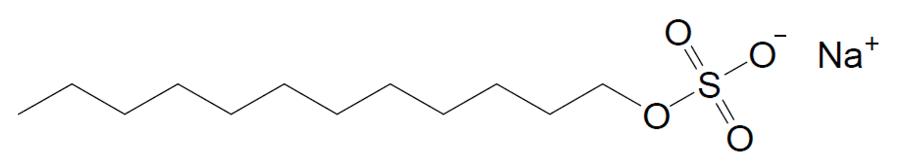
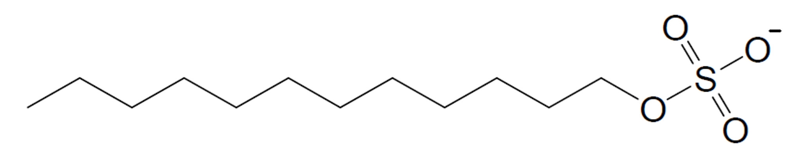
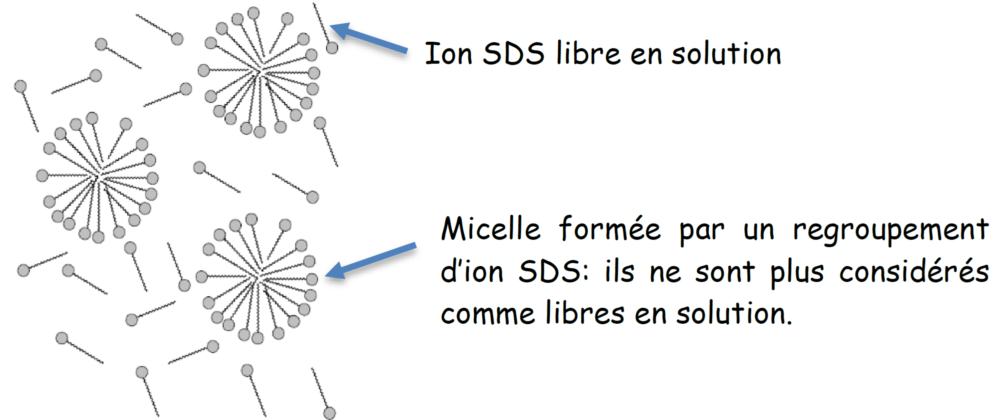

# 🧪 TP 1 – Mesure de la concentration micellaire critique (CMC) par conductimétrie

## 🎯 Objectifs du TP

### Objectifs scientifiques et cosmétologiques

- mettre en évidence le **comportement d’un tensioactif en solution aqueuse**,
- comprendre le lien entre **conductivité** et **concentration en ions libres**,
- déterminer expérimentalement la **concentration micellaire critique (CMC)**,
- relier un résultat expérimental à une **organisation moléculaire**.

### Objectifs méthodologiques (préparation E2)

- exploiter un **résultat expérimental**,
- analyser un **graphique scientifique**,
- identifier une **rupture de comportement**,
- rédiger une **conclusion scientifique argumentée**.

---

## 🧴 Contexte professionnel

Les tensioactifs sont des composants essentiels des **produits cosmétiques lavants**(shampooings, gels douche, savons liquides).

Le **dodécylsulfate de sodium (SDS)** est un tensioactif ionique couramment utilisé.
En formulation cosmétique, il est essentiel de connaître la **concentration minimale efficace** à partir de laquelle les micelles se forment : la **CMC**.

---

## 📎 Documents fournis

### Document 1 – Le dodécylsulfate de sodium (SDS)

Le **dodécylsulfate de sodium** ou **Laurylsulfate de sodium** (noté en abrégé SDS dans la littérature anglo-saxonne où son nom  est  Sodium  Dodecyl  Sulphate)  est  un  tensioactif  ionique  que  l’on  trouve  dans  les shampooings.

L’anion dodécylsulfate présente la particularité de posséder une tête hydrophile et une chaîne carbonée hydrophobe.

---

### Document 2 – La CMC : Concentration Micellaire Critique

En solution aqueuse, les ions dodécylsulfate peuvent s’organiser en donnant des agrégats
microscopiques nommés **micelles**.  
On envisage ici la formation de **micelles sphériques** : le cœur de la micelle est constitué des parties **hydrophobes** de l’ion dodécylsulfate ; les **têtes polaires** de cet ion, ainsi que des **contre-ions Na⁺**, se trouvent à la surface.

Les micelles ne se forment que si la concentration en tensioactif introduit $C(SDS)_{introduit}$ est **supérieure à une valeur limite** appelée **concentration micellaire critique (CMC)**.

On distingue deux situations :

- **Situation 1 :**  
    La concentration en tensioactif introduit  $C(SDS)_{introduit}$ est **inférieure à la CMC**.  
    Les ions $ \mathrm{C_{12}H_{25}OSO_3^-} $ sont **libres en solution** et leur concentration  $C(SDS)_{libre}$  est **égale à la concentration introduite**.

- **Situation 2 :**  
  La concentration en tensioactif introduit  $C(SDS)_{introduit}$  est **supérieure à la CMC**.  
  Des **micelles se forment**.  
  La concentration  $C(SDS)_{libre}$  des ions $ \mathrm{C_{12}H_{25}OSO_3^-} $ libres est alors **égale à la CMC**, même si la concentration introduite continue d’augmenter.

---

### Document 3 – Tout est question de concentration

Quand on ajoute du SDS à une solution aqueuse, celui-ci se dépose à la surface avec ses **têtes hydrophiles** en contact avec l’eau et les **queues hydrophobes apolaires** orientées vers l’air, afin de **minimiser les interactions défavorables** entre ces dernières et la phase aqueuse polaire.

Une fois que **toute la surface est recouverte de SDS** (la **CMC est alors atteinte**), les molécules de tensioactif ne peuvent plus s’y fixer.
La seule façon d’empêcher les **queues apolaires** d’entrer en contact avec la phase aqueuse est alors que ces dernières **s’agglutinent pour former des micelles**.

Les micelles peuvent alors **piéger les salissures grasses**, qui se concentrent au centre hydrophobe de la micelle.
C’est le **principe d’action des lessives, détergents, savons et shampooings**.

---

### Document 4 – Rappel : principe de la dilution

La dilution consiste à obtenir une solution **moins concentrée** à partir d’une solution initiale plus concentrée, appelée **solution mère**.

Lors d’une dilution :

- la **quantité de soluté** reste la même,
- seul le **volume de solution** augmente.

La relation de dilution s’écrit :

$ C_{mère} \times V = C_{fille} \times V' $

où :
- $ C_{mère} $ est la concentration de la solution mère,
- $ V $ est le volume de solution mère prélevé,
- $ C_{fille} $ est la concentration de la solution obtenue,
- $ V' $ est le volume final de la solution diluée.

On définit le **facteur de dilution** $ F $ par :

$ F = \dfrac{V'}{V} $

Plus le facteur de dilution est élevé, plus la solution obtenue est diluée.

⚠️ Lors d’une dilution :

- le prélèvement se fait à l’aide d’une **pipette**,
- le volume final est ajusté dans une **fiole jaugée**.

---

## 🧠 PARTIE A – Exploitation documentaire préalable

### 1. Structure du tensioactif SDS

1\. Identifier les **deux parties** de l’ion dodécylsulfate.  
    

2\. Préciser le **comportement de chacune** vis-à-vis de l’eau.  
    

3\. Justifier, à l’aide de la **polarité des liaisons**, le caractère hydrophile
et hydrophobe de ces parties.  
     

---

### 2. Organisation en solution aqueuse

4\. Décrire l’organisation des molécules de SDS :

- lorsque la concentration est **inférieure à la CMC**,
- lorsque la concentration est **supérieure à la CMC**.  
     

5\. Expliquer ce qu’est une **micelle** et préciser son **rôle en cosmétologie**.  
     

---

### 3. Définition de la CMC

6\. Proposer une **définition précise** de la CMC.  
    

7\. Expliquer pourquoi la CMC correspond à une **concentration seuil**.  
     

---

## 🧪 PARTIE B – Manipulation expérimentale

### 4. Protocole expérimental

Une solution **mère** de SDS de concentration massique  $C_{mère} = 11,5 {g·L}^{-1}$ a été préparée à l’avance afin d’éviter la formation de mousse.

On prélève différents volumes $ V $ de cette solution mère, que l’on dilue avec de l’eau distillée pour obtenir un **volume final de 50 mL**.

---

### 5. Principe de la dilution

8\. Rappeler le principe de la dilution reliant  $C_{mère}, V, C_{fille}, V'$.  
     

9\. Définir le **facteur de dilution $ F $**.  
     

---

### 6. Préparation des solutions

| Solution | S1 | S2 | S3 | S4 | S5 | S6 | S7 | S8 | S9 |
|--------|----|----|----|----|----|----|----|----|----|
| Volume prélevé (mL) | 1,0 | 3,0 | 5,0 | 9,5 | 10,5 | 12,5 | 14,5 | 16,0 | 17,5 |
| Facteur de dilution | | | | | | | | | |
| Concentration (g·L⁻¹) | | | | | | | | | |

  

10\. Décrire le **protocole de préparation** et la verrerie utilisée, parmi

-	Burette graduée, pipettes jaugées de 5, 10 et 20mL.
-	Petits béchers de prélèvement ou transvasement.
-	Béchers de 50mL.
-	Fiole jaugée de 50mL.

     

---

### 7. Conductivité et concentration

La conductivité $ \sigma $ d’une solution ionique est proportionnelle à la **concentration en ions libres** : $ \sigma = k \times C $

11\. Quelle est l’allure attendue de la courbe   $ \sigma = f(C) $ ?  
     

---

### 8. Mesure de la conductivité

| Solution | S1 | S2 | S3 | S4 | S5 | S6 | S7 | S8 | S9 |
|--------|----|----|----|----|----|----|----|----|----|
| Concentration (g·L⁻¹) | | | | | | | | | |
| Conductivité (mS·cm⁻¹) | | | | | | | | | |

---

## 🧠 PARTIE C – Exploitation des résultats

12\. Tracer le graphique $ \sigma = f(C) $.  

13\. Mettre en évidence **deux zones de comportement**.  
     

14\. Déterminer graphiquement la **CMC du SDS** (en g·L⁻¹).  
     

---

## ✍️ PARTIE D – Interprétation cosmétologique (E2)

15\. Le fait d’augmenter fortement la concentration en SDS
au-delà de la CMC est-il pertinent ?  Rédiger une **réponse argumentée (6 à 8 lignes)**.  
      

---

## 🧾 Conclusion

Valeur de la CMC – sens physico-chimique – intérêt en formulation cosmétique.  
       

---

## 🔗 Lien explicite avec la méthode

Pour analyser correctement ces documents, se référer à :

➡️ [**Fiche méthode 01 – Exploiter un graphique de CMC**](https://bts-mecp-cosmetologie-f42365.forge.apps.education.fr/Methodologie/01_fiche_methode/)